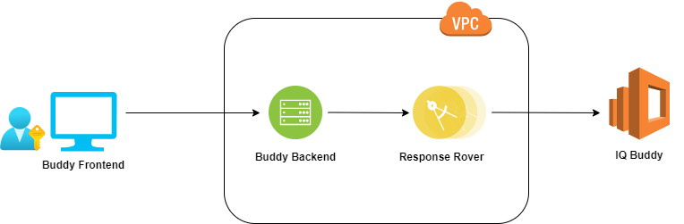

# Welcome to Question Buddy!

Hey, we are building a Q&A application. The purpose of the application is simple. A user signs into the application and uploads a file of questions. Then Question Buddy answers those questions. Question Buddy is very generous; he gives two answers for each question. But occasionally he may miss one as well. 

## Anatomy of Question Buddy
Question Buddy consists of 4 main components. 

 - Buddy Frontend
 - Buddy Backend
 - Response Rover
 - IQ Buddy

###  Buddy Frontend 
This is the Gateway to Question Buddy. Users can log in to Buddy Frontend and upload a file with a list of questions they have. The file must have the structure defined in Question Template. Once the list is uploaded all questions are visible to the user so that he/she can double-check. Once he/she is confident about the questions he/she can ask Question Buddy to go and fetch answers. Then Buddy Frontend requests answers from Buddy Backend. When the answers are received, they are displayed to the user. When displaying the answers, Buddy Frontend makes sure to align both answers with the question. When no answers are found Buddy Frontend humbly and sadly displays *I'm Sorry. No answers were found for your question*. Then user can sign out or upload another question list. 

###  Buddy Backend
Buddy Backend interacts with the Buddy Frontend. All requests from Buddy Frontend including authentication are handled by Buddy Backend. Buddy Backend tunnels most incoming requests to Response Rover and tries its best to answer all queries come from Buddy Frontend.
 - For each user
    - Question count
    - How many questions had both answers
    - How many questions had a single answer
    - How many questions without answers

###  Response Rover
Response Rover is the microservice that resolves queries coming from Buddy Backend. When Buddy Backend sends the question list, Response Rover sends those questions to IQ Buddy and sends the responses back. Response Rover has a well-defined API specification and it works according to that. IQ Buddy sits behind an authentication layer so it's Response Rover's responsibility to provide proper credentials and get the job done. 

### IQ Buddy 
IQ Buddy is an application developed by another team and works as a web service. It exposes its capabilities via a set of well-defined APIs. Not much information about IQ Buddy is available except the published API specification. 

## A bit more about Question Buddy
Question Buddy is not just an answering machine. It tracks the following information as well.
 - For each user
    - Question count
    - How many questions had both answers
    - How many questions had a single answer
    - How many questions without answers

- For each question list
    - How long does it take for IQ Buddy to respond.
- Average time to answer a question.
- Number of `questions without answers` as a percentage of the overall question count.

None of the above information is exposed via Question Buddy. They are only tracked for future reference.

## Bird's Eye view of Question Buddy

## Here Comes the Challenge..
You are going to build the Question Buddy by implementing 
- Buddy Frontend
- Buddy Backend
- Response Rover

####  Buddy Frontend & Buddy Frontend
- This needs to be a NextJS (14) application. 
- Authentication must be handled within the NextJS application. 
- Buddy Backend should communicate with the Response Rover to get answers to the user questions. 
- The question lists are available in https://qna.convogrid.ai?id=identifier. When you visit the URL a JSON file of questions will be downloaded. 
- Keep in mind a file is only valid for 2 hours after initial download. You can download a new file by visiting the above URL after the current file is expired. 
- The `identifier` will be shared with you separately.

####  Response Rover
- This needs to be a NodeJS project. 
- You have to implement the given API specification properly. 
- The Response Rover doesn't need to be behind an authentication layer.
- The IQ Buddy host is https://iqbuddy.convogrid.ai. 
- Authentication details will be shared with you separately. 

## Final Remarks
- Only MongoDB is permitted as the persistence layer.
- This is an open challenge with plenty of room for innovative thinking. 
- Make sure to read all sections carefully as the functional and non-functional requirements may hidden in plain sight. 